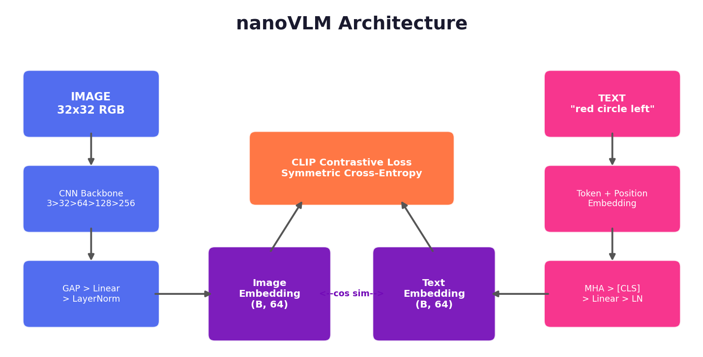
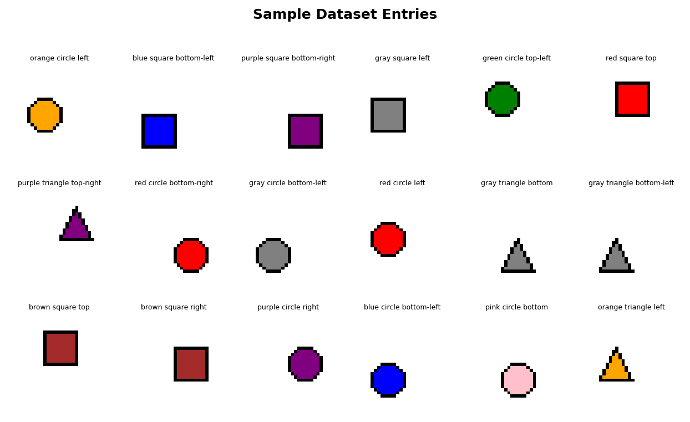
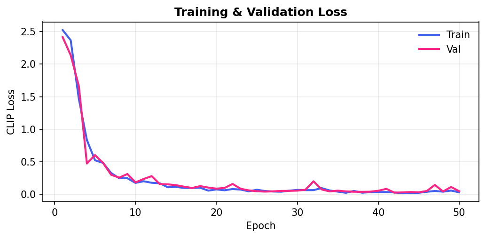
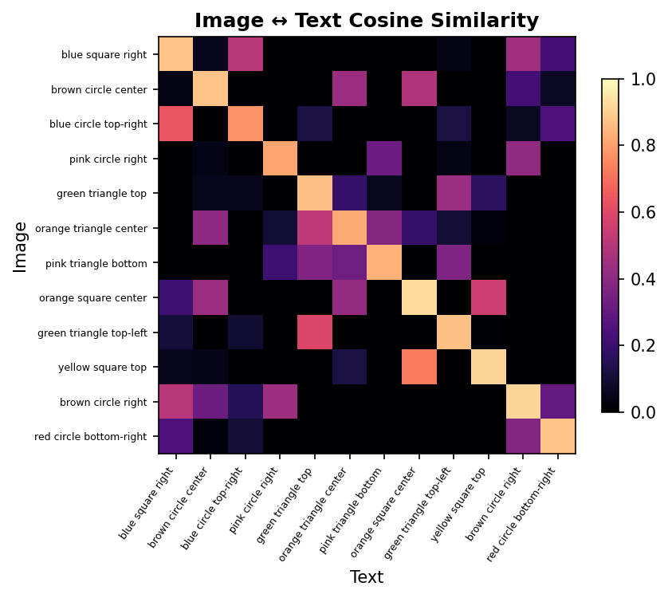
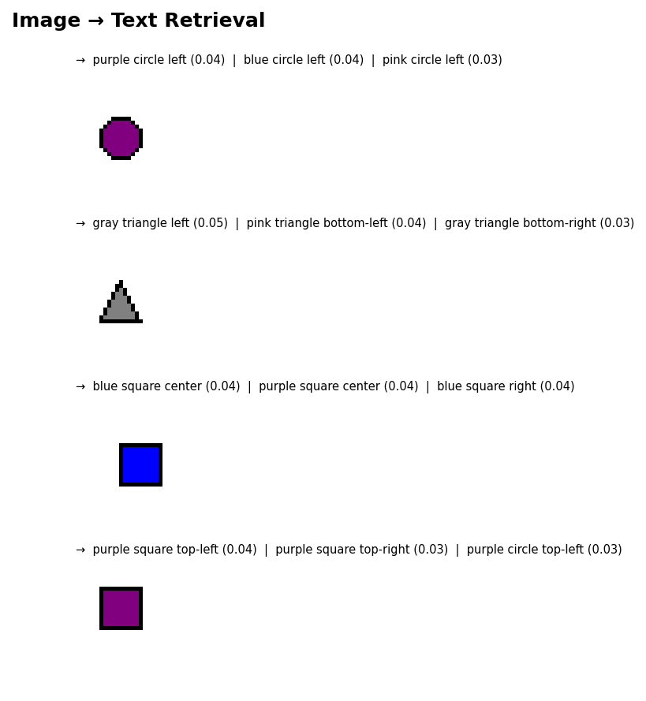
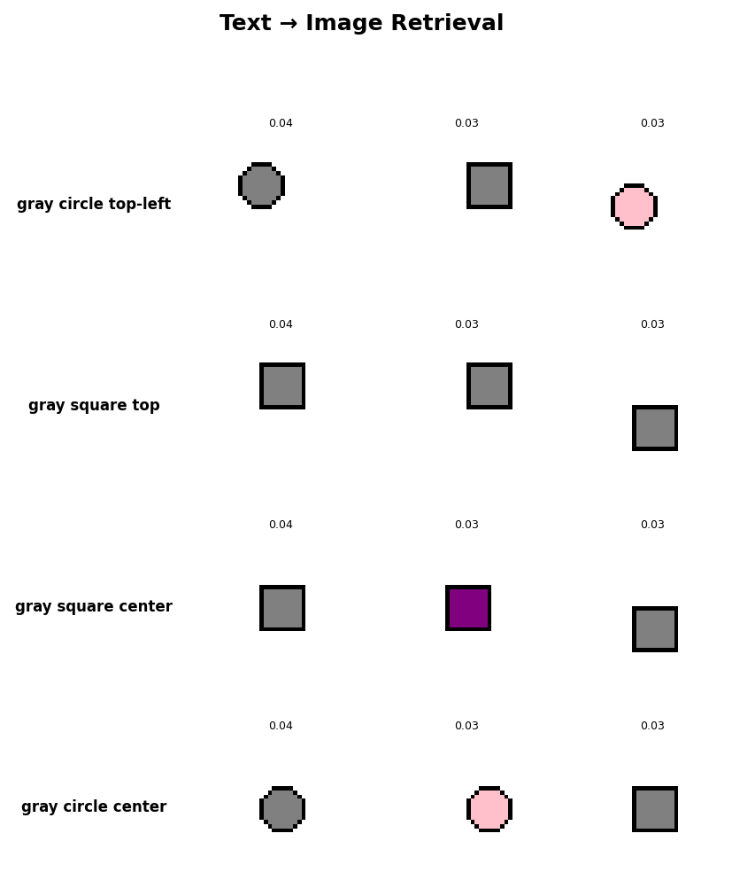

<p align="center">
  <h1 align="center">nanoVLM</h1>
  <p align="center">
    A minimal CLIP implementation from scratch — learn contrastive vision-language alignment in ~400 lines of PyTorch.
  </p>
</p>

<p align="center">
  
  
  
  
</p>

---

## What is this?

**nanoVLM** is a from-scratch, pedagogical implementation of [CLIP](https://arxiv.org/abs/2103.00020) (Contrastive Language–Image Pretraining) that trains on a **procedurally generated shapes dataset** — no downloads, no GPUs, no pretrained weights. The entire model trains in **under 2 minutes on CPU**.

It's designed to make the core ideas of vision-language contrastive learning **tangible and hackable**:

- **Image Encoder** — a tiny 4-layer CNN that maps 32×32 RGB images to 64-d vectors
- **Text Encoder** — token + positional embeddings → multi-head self-attention → [CLS] pooling
- **CLIP Loss** — symmetric cross-entropy over cosine similarity, pushing matched pairs together

<p align="center">
  
</p>

## Dataset

243 procedurally generated images: **9 colours × 3 shapes × 9 positions**, each paired with a caption like `"red circle top-left"`.

<p align="center">
  
</p>

## Results

After 50 epochs of training (~90 seconds on CPU):

| Metric | Score |
|--------|-------|
| **Image→Text R@1** | 93.9% |
| **Image→Text R@3** | 100% |
| **Text→Image R@1** | 100% |
| **Text→Image R@3** | 100% |

### Loss Curve

<p align="center">
  
</p>

### Similarity Matrix

The cosine-similarity heatmap shows the model has learned to align matching image–text pairs (bright diagonal) while pushing non-matching pairs apart:

<p align="center">
  
</p>

### Retrieval Examples

**Image → Text:** given a query image, find the best caption.

<p align="center">
  
</p>

**Text → Image:** given a query caption, find the best image.

<p align="center">
  
</p>

## Project Structure

```
nanoVLM/
├── train.py                 # One-command training script
├── demo.py                  # Interactive retrieval demo
├── requirements.txt
│
├── nanovlm/                 # Core library
│   ├── __init__.py          # Public API
│   ├── config.py            # All hyperparameters (dataclasses)
│   ├── dataset.py           # Synthetic shapes dataset + loaders
│   ├── models.py            # ImageEncoder (CNN) + TextEncoder (attention)
│   ├── loss.py              # Symmetric CLIP contrastive loss
│   ├── trainer.py           # Training loop with checkpointing
│   ├── evaluate.py          # Recall@K metrics + retrieval helpers
│   └── visualize.py         # Loss curves, heatmaps, retrieval galleries
│
├── assets/                  # Generated plots for README
└── checkpoints/             # Saved model weights (git-ignored)
```

## Quick Start

### Install

```bash
git clone https://github.com/YOUR_USERNAME/nanoVLM.git
cd nanoVLM
pip install -r requirements.txt
```

### Train

```bash
python train.py
```

This trains both encoders for 50 epochs, saves the best checkpoint to `checkpoints/best.pt`, prints Recall@K metrics, and generates all plots in `assets/`.

**Customise:**

```bash
python train.py --epochs 100 --lr 1e-3 --batch_size 24 --embed_dim 128
```

### Demo

```bash
python demo.py
```

Loads the trained checkpoint and runs image↔text retrieval with visualisations.

### Use as a Library

```python
from nanovlm import (
    ShapesDataset, build_loaders,
    ImageEncoder, TextEncoder,
    train, TrainConfig,
    embed_loader, recall_at_k,
)

dataset = ShapesDataset()
train_loader, val_loader = build_loaders(dataset)

img_enc = ImageEncoder()
txt_enc = TextEncoder(vocab_size=dataset.vocab_size)

history = train(img_enc, txt_enc, train_loader, val_loader)

bank = embed_loader(img_enc, txt_enc, val_loader, dataset)
print(recall_at_k(bank["img_emb"], bank["txt_emb"]))
```

## How It Works

### 1. Contrastive Objective

For a batch of **B** image–text pairs, CLIP computes a **B×B** similarity matrix. The diagonal entries (matched pairs) should score high; off-diagonal entries (mismatched pairs) should score low. The loss is symmetric cross-entropy over both rows (image→text) and columns (text→image).

### 2. Image Encoder

Four convolutional layers with stride-2 downsampling (32×32 → 2×2), followed by global average pooling and a linear projection to the shared embedding dimension. Output is L2-normalised.

### 3. Text Encoder

Captions are tokenised into `[CLS] color shape position` (4 tokens). Token and positional embeddings are summed, passed through multi-head self-attention (4 heads), and the [CLS] vector is projected into the shared space. Output is L2-normalised.

### 4. Temperature Scaling

A temperature parameter (τ = 0.07) sharpens the softmax distribution over the similarity matrix, making the contrastive signal stronger.

## Extending This Project

Some ideas if you want to take nanoVLM further:

- **Richer dataset** — add more shapes (star, pentagon), sizes (small/large), or multi-object scenes
- **Learnable temperature** — make τ a trainable `nn.Parameter` as in the original CLIP
- **Vision Transformer** — swap the CNN for a patch-based ViT encoder
- **Real images** — port the architecture to CIFAR-10 or a small subset of Flickr30k
- **Zero-shot classification** — encode class labels as text and classify images by similarity
- **Deeper text encoder** — stack multiple transformer layers

## References

- Radford, A. et al. (2021). [*Learning Transferable Visual Models From Natural Language Supervision*](https://arxiv.org/abs/2103.00020). ICML.

